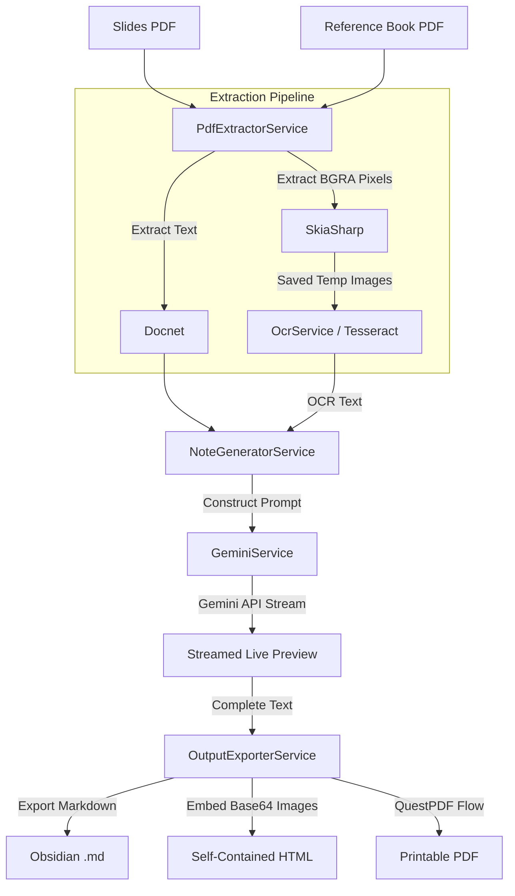

# 🎓 LectureSmith

[](https://dotnet.microsoft.com/en-us/languages/csharp)
[](https://dotnet.microsoft.com/download)
[](https://avaloniaui.net/)
[](#)
[](LICENSE)

**LectureSmith** is a high-performance, modern desktop application designed for students and educators. It automatically generates comprehensive study notes from lecture slides (PDFs) by integrating with **Google AI Studio (Gemini API)**. 

Students can upload their slides, optionally attach relevant textbook chapters to enrich the notes, select target courses, and choose output formats (Obsidian, HTML, PDF).

---

## 🌟 Key Features

* **Multi-Modal Slide Processing**: Extract raw text, run native OCR scans (to capture text inside code screenshots/diagrams), or send slide images directly via Vision AI to capture visual layouts.
* **Textbook Context Integration**: Upload reference textbook PDFs and specify chapters/page ranges (e.g. `Ch 10, p305-340`) to merge textbook details directly into the generated notes.
* **Modern Desktop Interface**: Polished, dark-themed UI matching premium applications. Features smooth drag-and-drop file ingestion, dynamic validation status colors, and responsive progress tracking.
* **Advanced Gemini AI Integration**: Supports multiple model endpoints (Gemini 3.5 Flash, Gemini 3.5 Pro) with toggleable AI thinking/reasoning modes for complex subjects.
* **Clean Exporters**: Output beautiful Obsidian-compatible Markdown, self-contained HTML (with embedded base64 images), or clean, printable PDFs.
* **Secure API Key Management**: Never hardcoded. Keys are saved securely in the local user's AppData directory (`%APPDATA%/LectureSmith/settings.json`) or loaded automatically from environment variables (`GEMINI_API_KEY` or `GOOGLE_API_KEY`).

---

## 🛠 Tech Stack

* **Language**: C# / .NET 9.0
* **Desktop UI**: Avalonia UI (using MVVM with CommunityToolkit.Mvvm)
* **PDF Extraction**: Docnet.Core
* **OCR Scanner**: Tesseract OCR
* **Markdown Processor**: Markdig
* **PDF Document Builder**: QuestPDF
* **Graphics Library**: SkiaSharp (bundled with Avalonia)
* **API Wrapper**: Mscc.GenerativeAI

---

## 📐 Architecture & Flow



---

## 🚀 How to Download and Run

### 1. Download the Executable
Download the pre-compiled, self-contained executable from the [GitHub Releases](https://github.com/your-username/LectureSmith/releases) page.

### 2. Enter API Key
1. Obtain a free API key from [Google AI Studio](https://aistudio.google.com/).
2. Run the application, click the **Settings (⚙)** icon, paste your key, and click **Save**.
3. *Alternative:* Set a system environment variable named `GEMINI_API_KEY` or `GOOGLE_API_KEY` and the app will load it automatically on startup.

### 3. Generate Notes
1. Drag and drop your lecture slides PDF onto the **Lecture Slides** zone.
2. Select your course, target mode, and preferred output format.
3. Browse and select a **Save Location** directory.
4. Click **⚡ Generate Notes**.

---

## 💻 Developer Setup

If you want to compile and modify the application locally, follow these steps:

### Prerequisites
* [.NET 9.0 SDK](https://dotnet.microsoft.com/download/dotnet/9.0)
* IDE of your choice (Visual Studio 2022, JetBrains Rider, or VS Code)

### Building the Project
1. Clone this repository:
   ```bash
   git clone https://github.com/your-username/LectureSmith.git
   cd LectureSmith
   ```
2. Restore NuGet dependencies:
   ```bash
   dotnet restore
   ```
3. Run the application in debug mode:
   ```bash
   dotnet run
   ```

### Packaging a New Standalone Release (.exe)
To package the app into a single self-contained executable for Windows x64:
```powershell
dotnet publish -c Release -r win-x64 -p:PublishSingleFile=true -p:SelfContained=true --self-contained true -p:IncludeNativeLibrariesForSelfExtract=true
```
The output executable will be compiled to `bin/Release/net9.0/win-x64/publish/LectureSmith.exe`.

---

## 📄 License
This project is licensed under the MIT License - see the [LICENSE](LICENSE) file for details.
