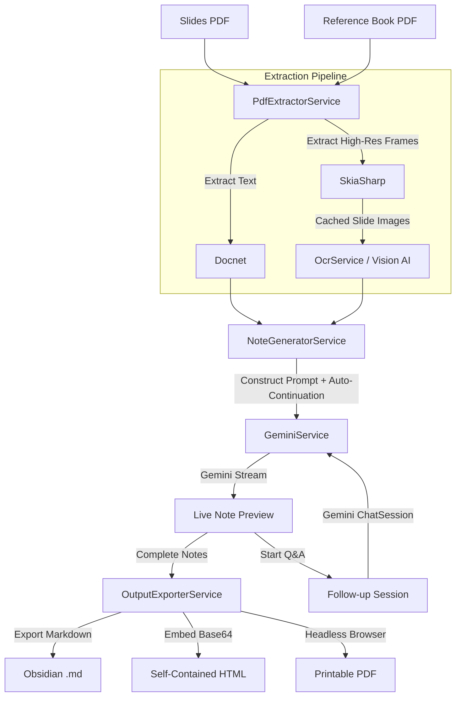

# 🎓 LectureSmith

[](https://dotnet.microsoft.com/en-us/languages/csharp)
[](https://dotnet.microsoft.com/download)
[](https://avaloniaui.net/)
[](#)
[](https://github.com/YaserBaker7/LectureSmith/releases)
[](LICENSE)

**LectureSmith** is a modern, high-performance desktop application designed for students and educators. It turns lecture slides (PDFs) and reference textbooks into comprehensive, beautifully structured study notes using **Google AI Studio (Gemini API)**.

Students can upload their lecture slides, optionally attach relevant textbook chapters to enrich the notes, select target courses, and export directly to **Obsidian Markdown**, **self-contained HTML**, or **printable PDF**.

---

## 🌟 What's New in v2.6.0.0

* 📐 **Comprehensive Math Typesetting (MathJax 3 + Custom Unicode Engine):**
  * Mathematical formulas, equations, fractions, and Greek notation (`$...$` and `$$...$$`) are cleanly rendered in both HTML and PDF outputs.
  * Markdown pipeline tuned to preserve LaTeX curly braces and mathematical subscript/superscript groupings.
* 🖨️ **High-Fidelity Headless Browser PDF Generation:**
  * Uses your installed browser (Microsoft Edge or Google Chrome) in isolated headless mode to produce crisp, publication-quality A4 PDFs with vector math and styled callouts.
  * Falls back automatically to QuestPDF if no browser is detected.
* 🧹 **Automatic Slide Cleanup for PDF & HTML Exports:**
  * For self-contained HTML (base64) and PDF (binary), temporary slide image folders are cleaned up automatically after export, keeping output folders tidy.
  * Obsidian markdown preserves the slide directory as needed for relative image embeds.
* ⚡ **Performance, Memory, and Error Handling Audits:**
  * Slide thumbnail bitmaps now implement deterministic disposal to minimize memory overhead.
  * Multi-core OCR and Docnet native calls fully thread-synchronized.
  * Pre-compiled segment parsing regex and defensive process tree termination for headless printing.

---

## 🚀 Key Features

### 📝 Smart Note Generation
* **Two Study Modes:**
  * **Missed Lecture (Detailed):** Comprehensive, professor-style explanations for students who missed the lecture entirely.
  * **Attended Lecture (Concise):** Focused review notes for students who attended and want clean, organized revision notes.

### 🎯 Multi-Modal Input & Textbook Context
* **Slide Extraction Modes:** Extract raw text, run native OCR scans (Tesseract), or send full slide images directly via Vision AI.
* **Textbook Integration:** Attach reference textbook PDFs with chapter and page ranges (e.g. `Ch 10, p305-340`) for deeper academic explanations.
* **Slide Skipping:** Skip administrative, syllabus, or irrelevant slides with a single click.

### 🌍 Multi-Language Support
* Auto-detect lecture slide language.
* Target output in **English** or **Danish**.

### 📄 Export Formats
* **Obsidian Notes (.md):** Includes slide image embeds (`![[slides/slide_XX.png]]`), callouts (`> [!tip]`), LaTeX formulas, and tables.
* **Self-Contained HTML (.html):** Standalone file with embedded base64 images, styled typography, MathJax 3 LaTeX math typesetting, and dark mode support.
* **Printable PDF (.pdf):** High-fidelity document layout with vector MathJax LaTeX typesetting, embedded slide images, and Obsidian-like typography via headless browser rendering.

### 🤖 AI Model Discovery & Management
* Dynamic model discovery querying Google AI API in real time.
* Free-tier indicators (`Gemini Flash / Lite`) vs. paid model indicators (`Pro / Max`).
* Optional AI reasoning/thinking mode for complex STEM subjects.
* Weekly and monthly token usage tracking.

---

## 🛠 Tech Stack

| Component | Technology |
|---|---|
| **Runtime & Language** | C# / .NET 9.0 |
| **Desktop UI** | Avalonia UI 11.3 (MVVM with CommunityToolkit.Mvvm) |
| **PDF Extraction** | Docnet.Core |
| **OCR Scanner** | Tesseract OCR 5.2 |
| **Markdown Processor** | Markdig |
| **PDF Generation** | Headless Browser Engine (Edge/Chrome) + QuestPDF Fallback |
| **Math Typesetting** | MathJax 3 + Custom Unicode MathFormatter |
| **Graphics Library** | SkiaSharp |
| **AI Integration** | Mscc.GenerativeAI (Google Gemini API) |

---

## 📐 Architecture & Pipeline


```mermaid
graph TD
    A[Slides PDF] --> B[PdfExtractorService]
    A2[Reference Book PDF] --> B

    subgraph Extraction Pipeline
        B -->|Extract Text| C[Docnet]
        B -->|Extract High-Res Frames| D[SkiaSharp]
        D -->|Cached Slide Images| E[OcrService / Vision AI]
    end

    C --> F[NoteGeneratorService]
    E --> F

    F -->|Construct Prompt + Auto-Continuation| G[GeminiService]
    G -->|Gemini Stream| H[Live Note Preview]

    H -->|Complete Notes| I[OutputExporterService]
    I -->|Export Markdown| J[Obsidian .md]
    I -->|Embed Base64| K[Self-Contained HTML]
    I -->|Headless Browser| L[Printable PDF]

    H -->|Start Q&A| M[Follow-up Session]
    M -->|Gemini ChatSession| G
```

---

## 📁 Project Structure

```
LectureSmith/
├── Models/              # Data models, enums, and DTOs
│   ├── AppSettings.cs
│   ├── ChatMessage.cs
│   ├── GeminiModelInfo.cs
│   ├── GenerationResult.cs
│   ├── GenerationSettings.cs
│   ├── LectureMode.cs
│   ├── NoteLanguage.cs
│   ├── OutputFormat.cs
│   ├── ProgressUpdate.cs
│   ├── SkippedSlideInfo.cs
│   ├── SlideProcessingMode.cs
│   └── UploadedFile.cs
├── Services/            # Business logic and external APIs
│   ├── GeminiService.cs
│   ├── MathFormatter.cs
│   ├── NoteGeneratorService.cs
│   ├── OcrService.cs
│   ├── OutputExporterService.cs
│   ├── PdfExtractorService.cs
│   ├── SettingsService.cs
│   └── TempFileCleanupService.cs
├── ViewModels/          # MVVM ViewModels
│   ├── MainWindowViewModel.cs
│   └── ViewModelBase.cs
├── Views/               # Avalonia XAML views
│   ├── MainWindow.axaml
│   └── MainWindow.axaml.cs
└── Assets/              # Icons and styling resources
    └── app-icon.ico
```

---

## 🚀 Download & Installation

### Option 1: Standalone Release (Recommended)
Download the pre-compiled, self-contained single-file executable from the [GitHub Releases](https://github.com/YaserBaker7/LectureSmith/releases) page.
* No .NET runtime installation required.
* Double-click `LectureSmith.exe` and start taking notes.

### Option 2: Build from Source
1. Ensure [.NET 9.0 SDK](https://dotnet.microsoft.com/download/dotnet/9.0) is installed.
2. Clone the repository:
   ```bash
   git clone https://github.com/YaserBaker7/LectureSmith.git
   cd LectureSmith
   ```
3. Restore dependencies & run:
   ```bash
   dotnet restore
   dotnet run
   ```

### Publishing a Standalone Release (.exe)
```powershell
dotnet publish -c Release -r win-x64 -p:PublishSingleFile=true -p:SelfContained=true --self-contained true -p:IncludeNativeLibrariesForSelfExtract=true
```
The output executable is compiled to `bin/Release/net9.0/win-x64/publish/LectureSmith.exe`.

---

## ⚙️ Setup & Configuration

1. **Google AI Studio API Key:**
   * Get a free API key from [Google AI Studio](https://aistudio.google.com/).
   * Click the **Settings (⚙)** icon in LectureSmith, paste your key, and click **Save & Validate**.
   * *Alternative:* Set an environment variable `GEMINI_API_KEY` or `GOOGLE_API_KEY`.
2. **Settings Persistence:**
   * Application settings are securely saved to `%APPDATA%\LectureSmith\settings.json`.

---

## 📄 License
This project is licensed under the MIT License — see the [LICENSE](LICENSE) file for details.
